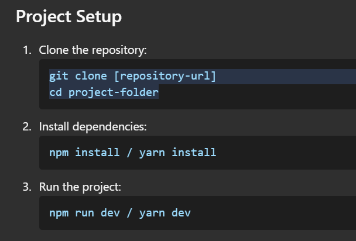

BeyondChats Assignment Submission

Live Demo

Live Website URL (https://beyond-chats-2kn1xk8tx-vmewada01s-projects.vercel.app)

Tech Stack

Frontend Framework: ReactJS + Typescript

Styling: CSS / Tailwind / Antd / framer-motion 

Libraries Used: ( Framer Motion, canvas-confetti, react-google-auth etc.)

Features Implemented

1. User Registration

User can sign up with name, email, and password.

"Continue with Google" option available.

Email verification step included.

2. Setup Organization

User enters company details (name, website URL, description).

Display dummy web pages and their scraping statuses (Pending, Scraped, etc.).

Clickable pages show dummy data chunks.

3. Chatbot Integration & Testing

Test chatbot button: Opens client's website with chatbot embedded.

Integration options:

Instructions to copy and paste script into <head>.

Option to email integration steps to the developer.

Test integration button:

Displays a success UI with confetti animation.

Shows "Explore Admin Panel", "Start Chatting", and social media sharing buttons.

Displays an alternate UI if integration is not detected.

## Contact  
**Vishal Mewada**  
Frontend Developer  
📧 vishalmewada9826@gmail.com  
📞 9826736077 